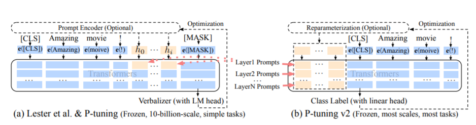
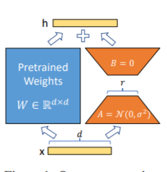
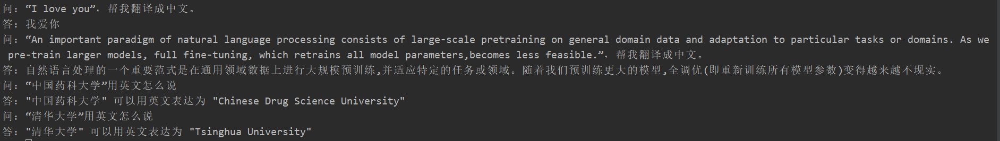
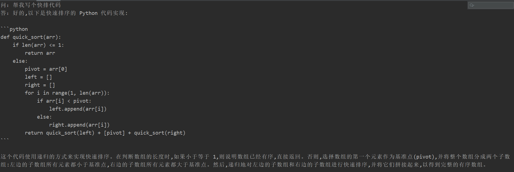
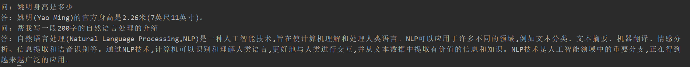

## ChatGLM微调
本项目主要针对ChatGLM模型进行不同方式的微调，并对比大模型在不同微调方法上的效果，主要针对信息抽取任务、生成任务、分类任务等。

为了模型适配其他方法，对官方ChatGLM模型文件进行了部分修改，将820-821行参数冻结代码删掉，再外部进行参数冻结。

上述实验结果均基于单卡训练，并发现模型微调之后，**并没有出现灾难性遗忘现象**。

由于官方模型和代码一直再更新，请使用项目中的代码，对应版本模型见[百度网盘](https://pan.baidu.com/s/1-UrZWnqw6Ciyo5K2NLraDg)，提取码：jh0l

- update-2023.04.18 **增加文本生成任务评测**
- update-2023.04.05 **增加信息抽取任务评测**

## 微调方法
### Freeze方法
Freeze方法，即参数冻结，对原始模型部分参数进行冻结操作，仅训练部分参数，以达到在单卡或不进行TP或PP操作，就可以对大模型进行训练。

微调代码，见finetuning_freeze.py，核心部分如下：
```python3
for name, param in model.named_parameters():
    if not any(nd in name for nd in ["layers.27", "layers.26", "layers.25", "layers.24", "layers.23"]):
        param.requires_grad = False
```
针对模型不同层进行修改，可以自行修改。
训练代码均采用DeepSpeed进行训练，可设置参数包含train_path、model_dir、num_train_epochs、train_batch_size、gradient_accumulation_steps、output_dir、prompt_text等，
可根据自己的任务配置。
```
CUDA_VISIBLE_DEVICES=0 deepspeed finetuning_freeze.py --num_train_epochs 5 --train_batch_size 2
```
三元组抽取的推理代码，见predict_freeze.py，其他任务可以根据自己的评价标准进行推理预测。

### PT方法
PT方法，即P-Tuning方法，参考[ChatGLM官方代码](https://github.com/THUDM/ChatGLM-6B/blob/main/ptuning/README.md) ，是一种针对于大模型的soft-prompt方法。


- P-Tuning仅对大模型的Embedding加入新的参数。[paper](https://arxiv.org/abs/2103.10385)
- P-Tuning-V2，将大模型的Embedding和每一层前都加上新的参数。[paper](https://arxiv.org/abs/2110.07602)
微调代码，见finetuning_pt.py，核心部分如下：
```python3
config = ChatGLMConfig.from_pretrained(args.model_dir)
config.pre_seq_len = args.pre_seq_len
config.prefix_projection = args.prefix_projection

model = ChatGLMForConditionalGeneration.from_pretrained(args.model_dir, config=config)

for name, param in model.named_parameters():
    if not any(nd in name for nd in ["prefix_encoder"]):
        param.requires_grad = False
```
当prefix_projection为True时，为P-Tuning-V2方法，在大模型的Embedding和每一层前都加上新的参数；为False时，为P-Tuning方法，仅在大模型的Embedding上新的参数。

训练代码均采用DeepSpeed进行训练，可设置参数包含train_path、model_dir、num_train_epochs、train_batch_size、gradient_accumulation_steps、output_dir、prompt_text、pre_seq_len、prompt_text等，
可根据自己的任务配置。
```
CUDA_VISIBLE_DEVICES=0 deepspeed finetuning_pt.py --num_train_epochs 5 --train_batch_size 2 --pre_seq_len 16
```
三元组抽取的推理代码，见predict_pt.py，其他任务可以根据自己的评价标准进行推理预测。

### Lora方法
Lora方法，即在大型语言模型上对指定参数（权重矩阵）并行增加额外的低秩矩阵，并在模型训练过程中，仅训练额外增加的并行低秩矩阵的参数。
当“秩值”远小于原始参数维度时，新增的低秩矩阵参数量也就很小。在下游任务tuning时，仅须训练很小的参数，但能获取较好的表现结果。


- 论文：[paper](https://arxiv.org/abs/2106.09685)
- 官方代码：[Github](https://github.com/microsoft/LoRA)
- HuggingFace封装的peft库：[Github](https://github.com/huggingface/peft)

微调代码，见finetuning_lora.py，核心部分如下：
```python3
model = ChatGLMForConditionalGeneration.from_pretrained(args.model_dir)
config = LoraConfig(r=args.lora_r,
                    lora_alpha=32,
                    target_modules=["query_key_value"],
                    lora_dropout=0.1,
                    bias="none",
                    task_type="CAUSAL_LM",
                    inference_mode=False,
                    )

model = get_peft_model(model, config)
```
训练代码均采用DeepSpeed进行训练，可设置参数包含train_path、model_dir、num_train_epochs、train_batch_size、gradient_accumulation_steps、output_dir、prompt_text、lora_r等，
可根据自己的任务配置。
```
CUDA_VISIBLE_DEVICES=0 deepspeed finetuning_lora.py --num_train_epochs 5 --train_batch_size 2 --lora_r 8
```
三元组抽取的推理代码，见predict_lora.py，其他任务可以根据自己的评价标准进行推理预测。

注意：对于结果需要保持一致的任务，需要保存模型的adapter_config.json文件中，inference_mode参数修改成false，并将模型执行model.eval()操作。
主要原因是chatglm模型代码中，没有采用Conv1D函数。

### 运行环境
查看requirements.txt文件

## 实验结果
### 三元组抽取
- 为了防止大模型的数据泄露，采用一个领域比赛数据集-[汽车工业故障模式关系抽取](https://www.datafountain.cn/competitions/584)，随机抽取50条作为测试集
- 模型训练时，最大长度为768，Batch大小为2，训练轮数为5，fp16训练，采用DeepSpeed的Zero-1训练；
- PT为官方的P-Tuning V2训练方法，PT-Only-Embedding表示仅对Embedding进行soft-prompt，Freeze仅训练模型后五层参数，Lora采用低秩矩阵方法训练，秩为8；
- 由于之间训练PT在48G-A40显卡上会出现OOM，因此下面PT实验对模型开启了gradient_checkpointing_enable()，使得模型显存占用变小，但训练时长增加。
- 训练示例：
```
prompt_text：你现在是一个信息抽取模型，请你帮我抽取出关系内容为\"性能故障\", \"部件故障\", \"组成\"和 \"检测工具\"的相关三元组，三元组内部用\"_\"连接，三元组之间用\\n分割。文本：
输入：故障现象：发动机水温高，风扇始终是低速转动，高速档不工作，开空调尤其如此。
输出：发动机_部件故障_水温高\n风扇_部件故障_低速转动
```


| 微调方法 |  PT-Only-Embedding |  PT | Freeze |  Lora | 
| ------- | ------ | ------  | ------ | ------ |
| 显卡占用 | 37G | 30G | 24G | 39G |
| 总参数 | 6.259B | 7.211B | 6.255B | 6.259B |
| 可训练参数占比 | 0.0586% | 13.26% | 16.10% | 0.0586% |
| 训练耗时 | 53min | 135min | 112min | 65min |
| 测试结果F1 | 0.0 | 0.6283 | 0.5675 | 0.5359 |
| 测试耗时 | 191s | 198s | 180s | 278s |

结构分析：
- 效果为PT>Freeze>Lora>PT-Only-Embedding
- PT-Only-Embedding效果很不理想，发现在训练时，最后的loss仅能收敛到2.几，而其他机制可以收敛到0.几。分析原因为，输出内容形式与原有语言模型任务相差很大，仅增加额外Embedding参数，不足以改变复杂的下游任务。
- PT方法占用显存更大，因为也增加了很多而外参数。
- 测试耗时，由于其他方法均增加了额外参数，因此推理耗时会比Freeze方法要高。
- 上面测试仅代表个人测试结果，并且由于生成模型生成长度对推理耗时影响很大，因此可以其他数据会有不一样的结果。
- 模型在指定任务上微调之后，并没有丧失原有能力，例如生成“帮我写个快排算法”，依然可以生成-快排代码。
- 由于大模型微调都采用大量instruction进行模型训练，仅采用单一的指令进行微调时，对原来其他的指令影响不大，因此并没导致原来模型的能力丧失。

很多同学在微调后出现了灾难性遗忘现象，但本项目的训练代码并没有出现，对“翻译任务”、“代码任务”、“问答任务”进行测试，采用freeze模型，可以用test_forgetting.py进行测试，具体测试效果如下：
<details><summary><b>翻译任务</b></summary>



</details>
<details><summary><b>代码任务</b></summary>



</details>
<details><summary><b>问答任务</b></summary>



</details>

### 文本生成
- 为了防止大模型的数据泄露，采用一个“万创杯”中医药天池大数据竞赛-[中医文献问题生成挑战](https://tianchi.aliyun.com/competition/entrance/531826/introduction)，随机抽取20条作为测试集
- PT为官方的P-Tuning V2训练方法，PT-Only-Embedding表示仅对Embedding进行soft-prompt，Freeze仅训练模型后五层参数，Lora采用低秩矩阵方法训练，秩为8；
- 训练示例：
```
prompt_text：你现在是一个问题生成模型，请根据下面文档生成一个问题，文档：
输入：紫色红薯是近年从日本引进的新品种红薯，中国农业大学农学与生物技术学院副院长刘庆昌指出，紫薯中的花青素具有显著的抗生物氧化作用，在延缓人体衰老方面具有非常好的效果。紫薯中所含赖氨酸、铜、锰、钾、锌的含量高于一般红薯5-8倍，尤其是抗癌物质碘、硒的含量比其他红薯高出20倍以上，占食物中的第一位。
输出：紫薯和红薯吃哪个好？
```
模型训练，以freeze方法为例：
```
CUDA_VISIBLE_DEVICES=0 nohup deepspeed --master_port 5555 finetuning_freeze.py --train_path "data/d2q_0.json" --output_dir "output_dir_freeze/" --prompt_text "你现在是一个问题生成模型，请根据下面文档生成一个问题，文档：" > log_fz.log 2>&1 &
```

由于生成模型的内容不能想信息抽取任务一样评价，用现有的BLUE或者Rouge来评价也是不合适，因此制定了评分规则。 通过多样性和准确性两个角度判断D2Q模型好坏，每个样本总计5分，共20个样本。
- 多样性：
	- 问题是否高度相似，每重复一个问题扣0.25分；
	- 问题对应答案是否相同，每有一个重复答案或找不到答案，扣0.25分；
- 准确性：
	- 问题能否从文档中找到答案，每有一个找不到答案，扣0.25分；
	- 问题内容是否流畅，每有一个问题不流畅，扣0.25分；
	- 问题内容是否有害，每有一个有害，扣0.25分；
	
测试数据见d2q_result_data/，测试代码见predict_d2q.py

| 微调方法 |  原始模型 | PT-Only-Embedding |  PT | Freeze |  Lora | 
| ------- | ------ | ------ | ------  | ------ | ------ |
| 分数 | 51.75 | 73.75 | 87.75 | 79.25 | 86.75 |


### 文本分类
待补充
